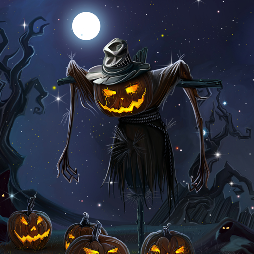

## Welcome to GitHub Pages                  

<h2 align="center">Hi , I'm Jack Hallowen, aka ᖫJackHalloween21ᖭ</h2>

<h3 align="center">A passionate and keenly interested LEARNER</h3>

- 🔭 I’m currently working on :Telegram Bots,app deployment on heroku,okteto,netlify,free vps.ect
- 
- 🌱 I’m currently learning : About Android Custom rom(8-12L) and recovery and kernel , Virtual Machine,Linux, Windows 7-11 (Deveploper Preview), RDP, VNC, MongoDB,Android App Emulation using Android Studio,Telegram Bot,Mac OS or HAckintosh...
- 
- 👯 I’m looking to collaborate on ...(Atleast something important in life)
- 
- 💬 tell me some **jokes**                                    
- 
- 
- 🤔 I’m looking for help with some issues in some repos..
- 
- 💬 Ask me about ...(Nothing, I am Ultimate Noob)
- 
- 📫 How to reach me:
-  
 

@jackhallloween21 :+1: This Repo looks great - it's ready to merge! :shipit:

 

 
 
 

## logos:

  

 
   

<h3 align="left">Languages and Tools:</h3>

  

<h2 align="center">
  My Github Stats 
</h2>

  Its just a Start

 

  
 
   
 
 
 
   
 

 
 

 
  

	

<tr>
<th><a href="source/plugins/isocalendar/README.md">📅 Isometric commit calendar</a></th>
</tr>

  

  

Full year calendar

   

 

With icons

 

 
 <th><a href="source/plugins/licenses/README.md">📜 Repository licenses</a></th>
 
 

 

Permissions, limitations and conditions

        
 

Licenses overview

   
   

      
 

 

Recent activity charts

 

        
 

 

By contribution types

  

        
<th><a href="source/plugins/skyline/README.md">🌇 GitHub Skyline 3D calendar</a></th>

 

 

      

  
 [[🌇 GitHub Skyline 3D calendar](https://skyline.github.com/jackhallloween21/2021)] 

 
 # Youtube Video (Installing Windows Subsystem with Magisk Manually)

# Halloween 🎃🦇👻

 

 Also called:

        Hallowe'en
                  
        All Hallowe'en
                  
        All Hallows' Eve
                  
        All Saints' Eve

<h2 align="center"> Carving a jack-o'-lantern is a common Halloween tradition.</h2>

**Halloween** or **Hallowe'en** (a contraction of "All Hallows' evening"), less commonly known as **Allhalloween**,**All Hallows' Eve**, or **All Saints' Eve**, is a celebration observed in many countries on 31 October, the eve of the Western Christian feast of All Hallows' Day. It begins the observance of Allhallowtide, the time in the liturgical year dedicated to remembering the dead, including saints (hallows), martyrs, and all the departed.

One theory holds that many Halloween traditions were influenced by Celtic harvest festivals, particularly the Gaelic festival Samhain, which are believed to have pagan roots.Some go further and suggest that Samhain may have been Christianized as All Hallow's Day, along with its eve, by the early Church. Other academics believe Halloween began solely as a Christian holiday, being the vigil of All Hallow's Day.Celebrated in Ireland and Scotland for centuries, Irish and Scottish migrants brought many Halloween customs to North America in the 19th century,and then through American influence, Halloween spread to other countries by the late 20th and early 21st century.

Halloween activities include trick-or-treating (or the related guising and souling), attending Halloween costume parties, carving pumpkins into jack-o'-lanterns, lighting bonfires, apple bobbing, divination games, playing pranks, visiting haunted attractions, telling scary stories, and watching horror or Halloween-themed films.For some people, the Christian religious observances of All Hallows' Eve, including attending church services and lighting candles on the graves of the dead, remain popular,although it is a secular celebration for others.Some Christians historically abstained from meat on All Hallows' Eve, a tradition reflected in the eating of certain vegetarian foods on this vigil day, including apples, potato pancakes, and soul cakes.

# Etymology:

The word *Halloween* or *Hallowe'en* dates to about 1745 and is of Christian origin.The word *Hallowe'en* means "Saints' evening".It comes from a Scottish term for *All Hallows' Eve* (the evening before All Hallows' Day).In Scots, the word *eve* is even, and this is contracted to *e'en* or *een*. Over time, (All) Hallow(s) E(v)en evolved into Hallowe'en. Although the phrase "All Hallows'" is found in Old English, "All Hallows' Eve" is itself not seen until 1556.

# History:
## Christian origins and historic customs

Halloween is thought to have roots in Christian beliefs and practices. The English word 'Halloween' comes from "All Hallows' Eve", being the evening before the Christian holy days of All Hallows' Day (All Saints' Day) on 1 November and All Souls' Day on 2 November. Since the time of the early Church, major feasts in Christianity (such as Christmas, Easter and Pentecost) had vigils that began the night before, as did the feast of All Hallows'.These three days are collectively called Allhallowtide and are a time when Christians honour saints and pray for recently departed souls who have yet to reach Heaven. Commemorations of all saints and martyrs were held by several churches on various dates, mostly in springtime. In 4th-century Roman Edessa it was held on 13 May, and on 13 May 609, Pope Boniface IV re-dedicated the Pantheon in Rome to "St Mary and all martyrs".This was the date of Lemuria, an ancient Roman festival of the dead.

Beginning in the 4th century, the feast of All Hallows' in the Western Christian Church commemorated Christian martyrs and in the 8th century, Pope Gregory III (731–741) founded of an oratory in St Peter's for the relics "of the holy apostles and of all saints, martyrs and confessors".Some sources say it was dedicated on 1 November, while others say it was on Palm Sunday. By 800, there is evidence that churches in Ireland and Northumbria were holding a feast commemorating all saints on 1 November. Alcuin of Northumbria, a member of Charlemagne's court, may then have introduced this 1 November date in the Frankish Empire. In 835, it became the official date in the Frankish Empire. Some suggest this was due to Celtic influence, while others suggest it was a Germanic idea, although it is claimed that both Germanic and Celtic-speaking peoples commemorated the dead at the beginning of winter. They may have seen it as the most fitting time to do so, as it is a time of 'dying' in nature. It is also suggested the change was made on the "practical grounds that Rome in summer could not accommodate the great number of pilgrims who flocked to it", and perhaps because of public health concerns over Roman Fever, which claimed a number of lives during Rome's sultry summers.
  

By the end of the 12th century they had become holy days of obligation in Western Christianity and involved such traditions as ringing church bells for souls in purgatory. It was also "customary for criers dressed in black to parade the streets, ringing a bell of mournful sound and calling on all good Christians to remember the poor souls". The Allhallowtide custom of baking and sharing soul cakes for all christened souls, has been suggested as the origin of trick-or-treating. The custom dates back at least as far as the 15th century and was found in parts of England, Wales, Flanders, Bavaria and Austria. Groups of poor people, often children, would go door-to-door during Allhallowtide, collecting soul cakes, in exchange for praying for the dead, especially the souls of the givers' friends and relatives. This was called "souling". Soul cakes were also offered for the souls themselves to eat, or the 'soulers' would act as their representatives. As with the Lenten tradition of hot cross buns, soul cakes were often marked with a cross, indicating they were baked as alms. Shakespeare mentions souling in his comedy The Two Gentlemen of Verona (1593). While souling, Christians would carry "lanterns made of hollowed-out turnips", which could have originally represented souls of the dead; jack-o'-lanterns were used to ward off evil spirits. On All Saints' and All Souls' Day during the 19th century, candles were lit in homes in Ireland, Flanders, Bavaria, and in Tyrol, where they were called "soul lights", that served "to guide the souls back to visit their earthly homes". In many of these places, candles were also lit at graves on All Souls' Day. In Brittany, libations of milk were poured on the graves of kinfolk, or food would be left overnight on the dinner table for the returning souls; a custom also found in Tyrol and parts of Italy.

Christian minister Prince Sorie Conteh linked the wearing of costumes to the belief in vengeful ghosts: "It was traditionally believed that the souls of the departed wandered the earth until All Saints' Day, and All Hallows' Eve provided one last chance for the dead to gain vengeance on their enemies before moving to the next world. In order to avoid being recognized by any soul that might be seeking such vengeance, people would don masks or costumes". It is claimed that in the Middle Ages, churches that were too poor to display relics of martyred saints at Allhallowtide let parishioners dress up as saints instead. Some Christians observe this custom at Halloween today. Lesley Bannatyne believes this could have been a Christianization of an earlier pagan custom. Many Christians in mainland Europe, especially in France, believed "that once a year, on Hallowe'en, the dead of the churchyards rose for one wild, hideous carnival" known as the danse macabre, which was often depicted in church decoration. Christopher Allmand and Rosamond McKitterick write in The New Cambridge Medieval History that the danse macabre urged Christians "not to forget the end of all earthly things". The danse macabre was sometimes enacted at village pageants and court masques, with people "dressing up as corpses from various strata of society", and this may be the origin of Halloween costume parties.

In Britain, these customs came under attack during the Reformation, as Protestants berated purgatory as a "popish" doctrine incompatible with the Calvinist doctrine of predestination. State-sanctioned ceremonies associated with the intercession of saints and prayer for souls in purgatory were abolished during the Elizabethan reform, though All Hallow's Day remained in the English liturgical calendar to "commemorate saints as godly human beings". For some Nonconformist Protestants, the theology of All Hallows' Eve was redefined; "souls cannot be journeying from Purgatory on their way to Heaven, as Catholics frequently believe and assert. Instead, the so-called ghosts are thought to be in actuality evil spirits". Other Protestants believed in an intermediate state known as Hades (Bosom of Abraham).In some localities, Catholics and Protestants continued souling, candlelit processions, or ringing church bells for the dead; the Anglican church eventually suppressed this bell-ringing. Mark Donnelly, a professor of medieval archaeology, and historian Daniel Diehl write that "barns and homes were blessed to protect people and livestock from the effect of witches, who were believed to accompany the malignant spirits as they traveled the earth". After 1605, Hallowtide was eclipsed in England by Guy Fawkes Night (5 November), which appropriated some of its customs. In England, the ending of official ceremonies related to the intercession of saints led to the development of new, unofficial Hallowtide customs. In 18th–19th century rural Lancashire, Catholic families gathered on hills on the night of All Hallows' Eve. One held a bunch of burning straw on a pitchfork while the rest knelt around him, praying for the souls of relatives and friends until the flames went out. This was known as teen'lay. There was a similar custom in Hertfordshire, and the lighting of 'tindle' fires in Derbyshire.Some suggested these 'tindles' were originally lit to "guide the poor souls back to earth". In Scotland and Ireland, old Allhallowtide customs that were at odds with Reformed teaching were not suppressed as they "were important to the life cycle and rites of passage of local communities" and curbing them would have been difficult.

In parts of Italy until the 15th century, families left a meal out for the ghosts of relatives, before leaving for church services. In 19th-century Italy, churches staged "theatrical re-enactments of scenes from the lives of the saints" on All Hallow's Day, with "participants represented by realistic wax figures". In 1823, the graveyard of Holy Spirit Hospital in Rome presented a scene in which bodies of those who recently died were arrayed around a wax statue of an angel who pointed upward towards heaven. In the same country, "parish priests went house-to-house, asking for small gifts of food which they shared among themselves throughout that night". In Spain, they continue to bake special pastries called "bones of the holy" (Spanish: Huesos de Santo) and set them on graves. At cemeteries in Spain and France, as well as in Latin America, priests lead Christian processions and services during Allhallowtide, after which people keep an all night vigil. In 19th-century San Sebastián, there was a procession to the city cemetery at Allhallowtide, an event that drew beggars who "appeal[ed] to the tender recollectons of one's deceased relations and friends" for sympathy.

 

# Symbols:
Development of artifacts and symbols associated with Halloween formed over time. Jack-o'-lanterns are traditionally carried by guisers on All Hallows' Eve in order to frighten evil spirits.There is a popular Irish Christian folktale associated with the jack-o'-lantern, which in folklore is said to represent a "soul who has been denied entry into both heaven and hell":

On route home after a night's drinking, Jack encounters the Devil and tricks him into climbing a tree. A quick-thinking Jack etches the sign of the cross into the bark, thus trapping the Devil. Jack strikes a bargain that Satan can never claim his soul. After a life of sin, drink, and mendacity, Jack is refused entry to heaven when he dies. Keeping his promise, the Devil refuses to let Jack into hell and throws a live coal straight from the fires of hell at him. It was a cold night, so Jack places the coal in a hollowed out turnip to stop it from going out, since which time Jack and his lantern have been roaming looking for a place to rest.

In Ireland and Scotland, the turnip has traditionally been carved during Halloween, but immigrants to North America used the native pumpkin, which is both much softer and much larger, making it easier to carve than a turnip.The American tradition of carving pumpkins is recorded in 1837 and was originally associated with harvest time in general, not becoming specifically associated with Halloween until the mid-to-late 19th century.

The modern imagery of Halloween comes from many sources, including Christian eschatology, national customs, works of Gothic and horror literature (such as the novels Frankenstein; or, The Modern Prometheus and Dracula) and classic horror films such as Frankenstein (1931) and The Mummy (1932). Imagery of the skull, a reference to Golgotha in the Christian tradition, serves as "a reminder of death and the transitory quality of human life" and is consequently found in memento mori and vanitas compositions; skulls have therefore been commonplace in Halloween, which touches on this theme. Traditionally, the back walls of churches are "decorated with a depiction of the Last Judgment, complete with graves opening and the dead rising, with a heaven filled with angels and a hell filled with devils", a motif that has permeated the observance of this triduum. One of the earliest works on the subject of Halloween is from Scottish poet John Mayne, who, in 1780, made note of pranks at Halloween; "What fearfu' pranks ensue!", as well as the supernatural associated with the night, "Bogies" (ghosts), influencing Robert Burns' "Halloween" (1785). Elements of the autumn season, such as pumpkins, corn husks, and scarecrows, are also prevalent. Homes are often decorated with these types of symbols around Halloween. Halloween imagery includes themes of death, evil, and mythical monsters. Black cats, which have been long associated with witches, are also a common symbol of Halloween. Black, orange, and sometimes purple are Halloween's traditional colors.

# Trick-or-treating and guising:

Trick-or-treating is a customary celebration for children on Halloween. Children go in costume from house to house, asking for treats such as candy or sometimes money, with the question, "Trick or treat?" The word "trick" implies a "threat" to perform mischief on the homeowners or their property if no treat is given. The practice is said to have roots in the medieval practice of mumming, which is closely related to souling. John Pymm wrote that "many of the feast days associated with the presentation of mumming plays were celebrated by the Christian Church." These feast days included All Hallows' Eve, Christmas, Twelfth Night and Shrove Tuesday. Mumming practiced in Germany, Scandinavia and other parts of Europe,involved masked persons in fancy dress who "paraded the streets and entered houses to dance or play dice in silence".

Girl in a Halloween costume in 1928, Ontario, Canada, the same province where the Scottish Halloween custom of guising was first recorded in North America
In England, from the medieval period, up until the 1930s, people practiced the Christian custom of souling on Halloween, which involved groups of soulers, both Protestant and Catholic,going from parish to parish, begging the rich for soul cakes, in exchange for praying for the souls of the givers and their friends.In the Philippines, the practice of souling is called Pangangaluwa and is practiced on All Hallow's Eve among children in rural areas.People drape themselves in white cloths to represent souls and then visit houses, where they sing in return for prayers and sweets.

In Scotland and Ireland, guising – children disguised in costume going from door to door for food or coins – is a traditional Halloween custom.It is recorded in Scotland at Halloween in 1895 where masqueraders in disguise carrying lanterns made out of scooped out turnips, visit homes to be rewarded with cakes, fruit, and money. In Ireland, the most popular phrase for kids to shout (until the 2000s) was "Help the Halloween Party". The practice of guising at Halloween in North America was first recorded in 1911, where a newspaper in Kingston, Ontario, Canada, reported children going "guising" around the neighborhood.

American historian and author Ruth Edna Kelley of Massachusetts wrote the first book-length history of Halloween in the US; The Book of Hallowe'en (1919), and references souling in the chapter "Hallowe'en in America". In her book, Kelley touches on customs that arrived from across the Atlantic; "Americans have fostered them, and are making this an occasion something like what it must have been in its best days overseas. All Halloween customs in the United States are borrowed directly or adapted from those of other countries".

While the first reference to "guising" in North America occurs in 1911, another reference to ritual begging on Halloween appears, place unknown, in 1915, with a third reference in Chicago in 1920. The earliest known use in print of the term "trick or treat" appears in 1927, in the Blackie Herald, of Alberta, Canada.

An automobile trunk at a trunk-or-treat event at St. John Lutheran Church and Early Learning Center in Darien, Illinois
The thousands of Halloween postcards produced between the turn of the 20th century and the 1920s commonly show children but not trick-or-treating. Trick-or-treating does not seem to have become a widespread practice in North America until the 1930s, with the first US appearances of the term in 1934,[175] and the first use in a national publication occurring in 1939.

A popular variant of trick-or-treating, known as trunk-or-treating (or Halloween tailgating), occurs when "children are offered treats from the trunks of cars parked in a church parking lot", or sometimes, a school parking lot. In a trunk-or-treat event, the trunk (boot) of each automobile is decorated with a certain theme, such as those of children's literature, movies, scripture, and job roles. Trunk-or-treating has grown in popularity due to its perception as being more safe than going door to door, a point that resonates well with parents, as well as the fact that it "solves the rural conundrum in which homes built a half-mile apart".

[My Github :computer: Repo:](https://github.com/jackhallloween21) 

 
  

## Light mode Sun or Dark mode Moon
<picture>
  <source media="(prefers-color-scheme: dark)" srcset="https://user-images.githubusercontent.com/25423296/163456776-7f95b81a-f1ed-45f7-b7ab-8fa810d529fa.png">
  <source media="(prefers-color-scheme: light)" srcset="https://user-images.githubusercontent.com/25423296/163456779-a8556205-d0a5-45e2-ac17-42d089e3c3f8.png">
  
</picture>

![Metrics](https://metrics.lecoq.io/jackhallloween21?template=classic&isocalendar=1&languages=1&stars=1&followup=1&people=1&code=1&activity=1&achievements=1&notable=1&discussions=1&lines=1&repositories=1&gists=1&base.indepth=false&base.hireable=false&repositories=100&repositories.batch=100&repositories.forks=false&repositories.affiliations=owner&isocalendar.duration=half-year&languages.limit=8&languages.threshold=0%25&languages.other=false&languages.colors=github&languages.sections=most-used&languages.indepth=false&languages.analysis.timeout=15&languages.categories=markup%2C%20programming&languages.recent.categories=markup%2C%20programming&languages.recent.load=300&languages.recent.days=14&stars.limit=4&followup.sections=repositories&followup.indepth=false&people.limit=24&people.identicons=false&people.identicons.hide=false&people.size=28&people.types=followers%2C%20following&people.shuffle=false&code.lines=12&code.load=400&code.days=3&code.visibility=public&activity.limit=5&activity.load=300&activity.days=14&activity.visibility=all&activity.timestamps=false&activity.filter=all&achievements.threshold=C&achievements.secrets=true&achievements.display=detailed&achievements.limit=0&notable.from=organization&notable.repositories=false&notable.indepth=false&notable.types=commit&discussions.categories=true&discussions.categories.limit=0&config.timezone=Asia%2FCalcutta)

